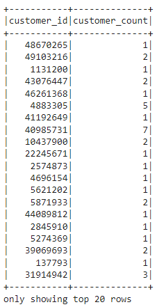
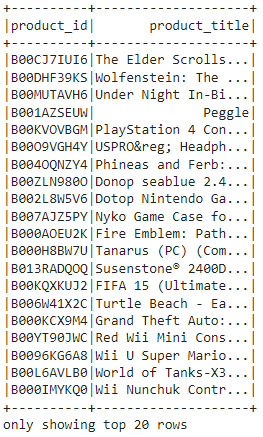
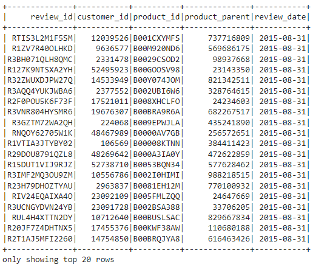

# Amazon_Vine_Analysis
analyzing Amazon reviews composed by members of the paid Amazon Vine program

## Overview
The purpose of this project is to analyze Amazon reviews that were written by members using Amazon Vine, a paid memborship program that allows manufacturers/ publishers to receive reviews for the products they sell through Amazon. Companies pay a small fee to Amazon and provide their products to members of the Vine program to review. Wea re to perform an anlysis on the Vine program by utilizing PySpark to perform ETL to extract the dataset and transform it into a CSV file to be loaded into pgAdmin in order to perform certain metric calculations for video games.

## Results

### Transforming the Data

The following four dataframes were created forom the raw data from Amazons video game portal :

1. customer_df

2. products_df

3. review_ID_df

4. Vine_df

