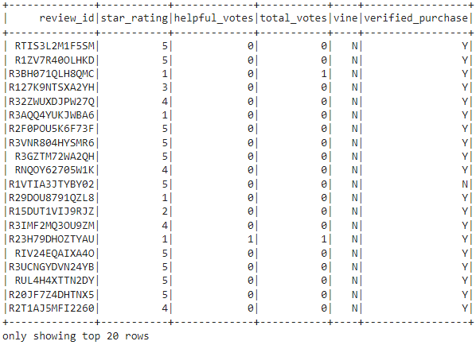

# Amazon_Vine_Analysis
analyzing Amazon reviews composed by members of the paid Amazon Vine program

## Overview
The purpose of this project is to analyze Amazon reviews that were written by members using Amazon Vine, a paid memborship program that allows manufacturers/ publishers to receive reviews for the products they sell through Amazon. Companies pay a small fee to Amazon and provide their products to members of the Vine program to review. Wea re to perform an anlysis on the Vine program by utilizing PySpark to perform ETL to extract the dataset and transform it into a CSV file to be loaded into pgAdmin in order to perform certain metric calculations for video games.

## Results

### Transforming the Data

The following four dataframes were created forom the raw data from Amazons video game portal :

1. customer_df

2. products_df

3. review_ID_df

4. Vine_df

The above table reveals the following:

- There are a total of 94 reviews from Vine members and a total of 40,471 reviews from non-Vine reviews, showing a huge disparity between the two groups in terms of numbers of reviews.
- Of the 94 Vine reviews, 48 were rated as five stars whereas 15,663 of the non-Vine reviews were rated as five stars
- Approximately 51% of the Vine reviews were five stars in comparison of around 38.7% of non-Vine reviews being rated as five stars.

## Summary

From the analysis, we can see that 51% of the reviews through the Vine program were ranked as five stars in comparison to the five star reviews from non-vine users being at 39%. This certainly suggests a somewhat of a bias from Vine members as they received the products directly from the company and would most likely to continue to be in the comapnys good graces to receive further products from them down the line. A recommended additional analysis would be the descriptive statistics of these reviews i.e. finding the mean, median and mode for the five star reviews between Vine and non-Vine reviews to better understand which group tends to favorably give more five star ratings.
